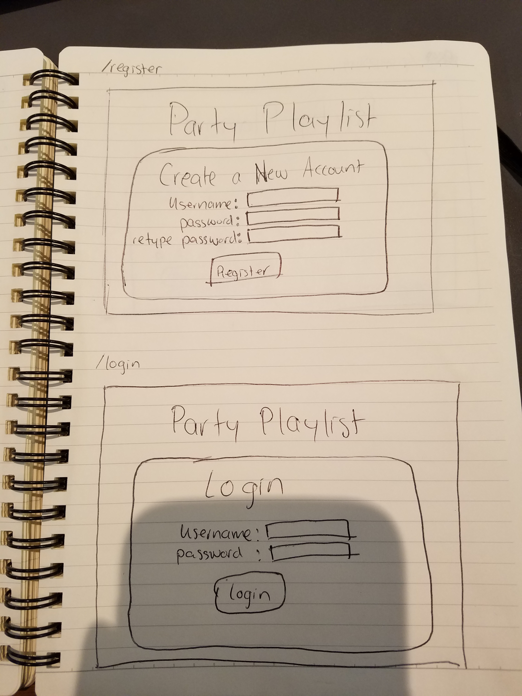
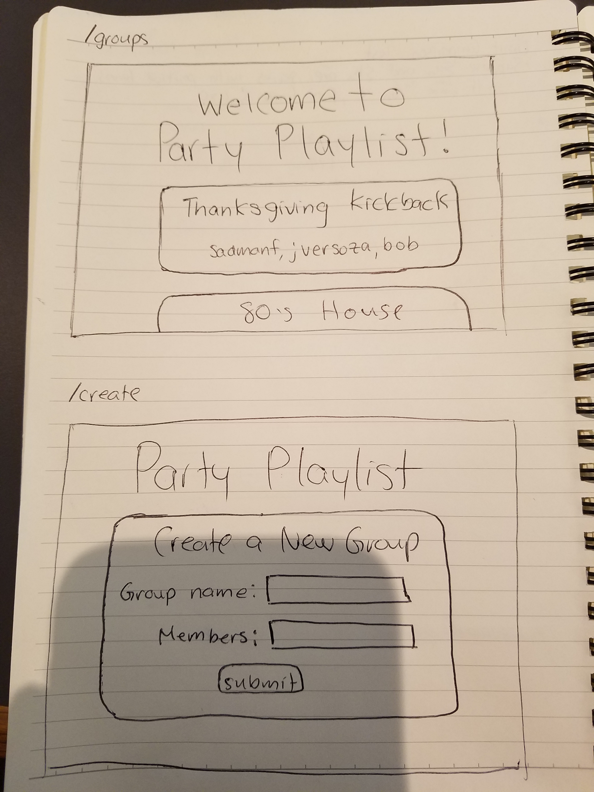
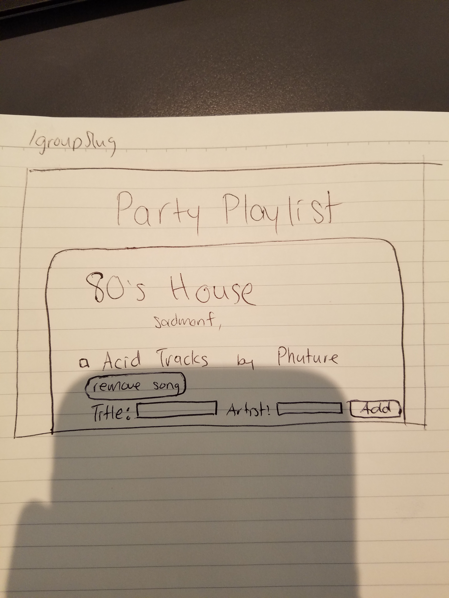
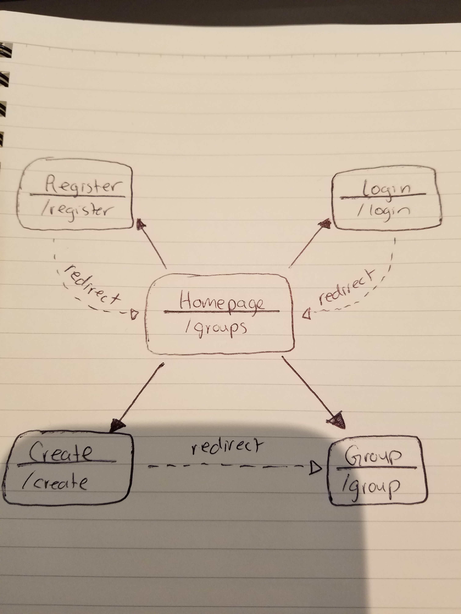

# Party Playlist 

## Overview

If you've ever been entrusted to picking music for everyone to jam out to, you know it's a pretty important job. You set the vibe for the whole place! Sometimes it gets hard picking the right songs to play for hours on end. Party Playlist is here to help!

Party Playlist is a web app that lets users create groups with each other and collaboratively create a music playlist. Users can register and log in, and then invite other users to a group. Within a group, users can either add/remove songs or import their Spotify/SoundCloud playlists.


## Data Model

The application will store Users, Groups and Songs

* users can have multiple groups (via references)
* each group can have several songs (by embedding)


An Example User:

```javascript
{
  username: "saddyboy",
  password: // a password,
  groups: // an array of references to Group documents
  // I should have a field for Spotify/SoundCloud accounts, but I still need to figure out how to do that
}
```

An Example Song:

```javascript
{
  id: String,
  title: String,
  artist: String,
  checked: Boolean, // lets users select songs to remove
}
```

An Example Group with Embedded Songs:

```javascript
{
  name: "Late Night Drive",
  songs: [
    { title: "Sad Machine", artist: "Porter Robinson", checked: false},
    { title: "Feather", artist: "Nujabes", checked: false},
  ],
  users: // array of usernames of all the users in a group

}
```


## [Link to First Draft Schema](db.js) 

## Wireframes

/register - page for creating a new account

/login - page for logging into user account



/groups - page that lists all the groups for a user

/create - page for creating a new group



/groupSlug - page for showing specific group



## Site map



## User Stories or Use Cases

1. as non-registered user, I can register a new account with the site
2. as a user, I can log in to the site
3. as a user, I can create a new group and invite other users to access it
4. as a user, I can view all of the groups I've created
5. as a user, I can add or remove songs to an existing group
6. as a user, I can connect to my SoundClound/Spotify account and import songs from playlists

## Topics

* Integrate user authentication through providers
    * I'm going to be using passport for user authentication
    * I'm going to allow users to log in to their Spotify/SoundCloud accounts and connect it to their own account.
* Spotify API
    * I am using the Spotify API so users can import their own playlists and store them in a Group.


## [Link to Initial Main Project File](app.js) 

## Annotations / References Used

1. [passport.js authentication docs](http://passportjs.org/docs)
2. [Spotify Web API for Node](https://github.com/thelinmichael/spotify-web-api-node) 